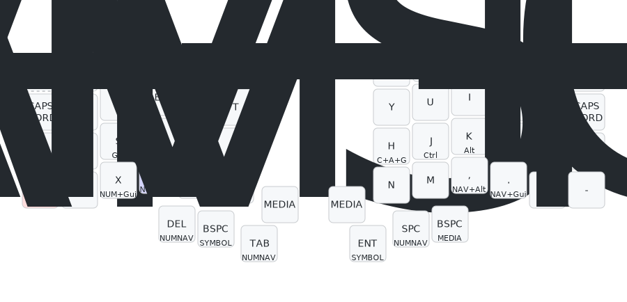
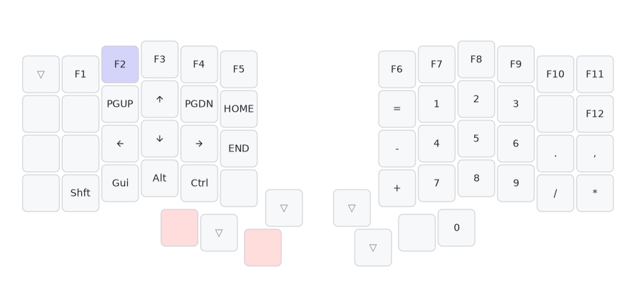
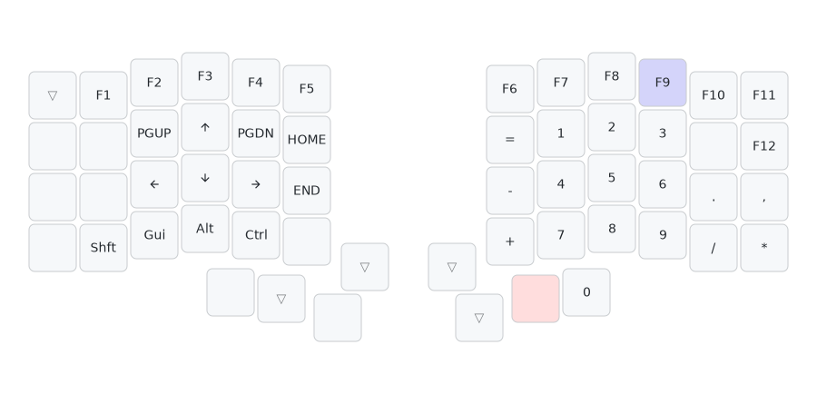

# QMK Userspace

## QWERTY Layout for the Keebio Iris

Notes: 
- For the layer switch keys, only 1 of the shaded key needs to be held. As you can see, most layers have multiple possible layer switch keys.
- Dotted outline keys: rarely used keys, considering removing.

### Examples:

**Word navigation (mods + arrow keys)**

Example on how to press Shift + Left:

This system of modifiers also composes nicely, for example to press Shift + Opt + Left (select one word to the left on Mac):

**1-handed copy paste etc (cmd/ctrl + c/v/z/x)**

Since the Cmd is a OSM (One Shot Modifier), it's not necesary to hold it down, you can press "OSM GUI", then "C".

Todo: add some way to switch between OSM Gui and OSM Ctrl to facilitate switching betweeen Mac and Windows.

**1-handed F1 to F12**

**1-handed arrow keys**

**Zoom in/out/reset (cmd/ctrl + =/-/0)**

## Development

First time setup:
- Setup the QMK toolchain (see the docs), this is needed for the `qmk` CLI to work
- Install just

Building the firmware: 
- Build the firmware: `just build`

How to reflash the keyboard:
- Go to multimedia layer (top uncovered thumb keys) + press top left (left half) / top right key (right half)
- Ideally we should flash both halves of the keyboard. Some features will work fine after flashing just 1 half (which firmware we use depends on which half is plugged in as the main), some will not.

Updating the diagram:
- Update the relevant yaml file in `diagrams/*.yaml`
- Run `just diagrams` to regenerate the SVGs

Updating key order/matrix diagrams in CLAUDE.md:
- The diagrams are generated using `scripts/visualize_matrix.py`
