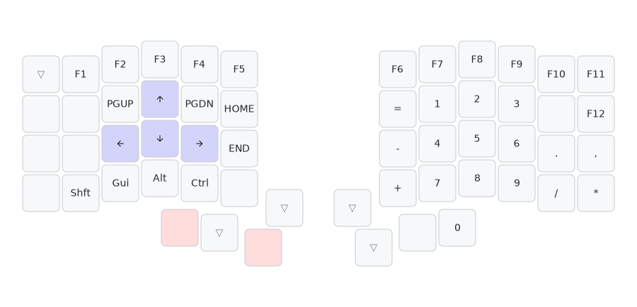

# QMK Userspace

A ~56 key QWERTY-based split keyboard layout for the Keebio Iris CE.

Aims:
1. Improve ergonomics for programming, including with vim keybindings
2. Cover all reasonable keys on a typical 75% US ANSI keyboard (ie. typical 14-inch laptop keyboard), while having a minimal number of layers and cognitive load
    - Current missing keys compared to 75% ANSI: caps lock (replaced with caps word), right hand modifiers (right shift/alt/control/GUI).
3. Make it easy to press **any** keyboard shortcut that can be pressed on a regular keyboard
4. (WIP) Be usable on windows, mac, linux
    - The layout is currently biased towards mac, as that's what I spend most of my time using currently. I do use the keyboard on windows + linux too, but the user experience is suboptimal, eg:
      - Accidental triggers of GUI HRMs (home row mods) on windows/linux are much more annoying, it tends to trigger much more disruptive behaviours like the start menu, screen lock, obscure windows functions (eg. windows feedback).
      - Ctrl + Z/X/C/V is awkward to press 1-handed, since only OSM GUI is setup

## Layout

Notes:
- For the layer switch keys, only 1 of the shaded key needs to be held. As you can see, most layers have multiple possible layer switch keys.
- Dotted outline keys: rarely used keys, considering removing.
- The natural resting position of my thumbs is on the **middle** thumb key (BSPC / SPC), which makes all 3 lower thumb keys easy to reach. My hands are probably considered unusually small; from my observations online, most other Iris users seem to rest their thumbs on the outer thumb key instead (TAB / ENTER).


## Design notes

### Covering most keys on 75% US ANSI while having a minimal number of layers and cognitive load

- Base layer + combos covers all of the keys on a 75% ANSI except for navigation keys
    - Base layer: alphabets, number row, some punctuation
    - Combos: F1-F12, remaining punctuation (backtick, square brackets, backslash)
    - Vertical combos are used over horizontal combos, as they practically never accidentally trigger and on a choc keyboard, can be pressed as easily as a single key, using just 1 finger.
    - Modifier keys (shift, alt, ctrl, GUI): available through HRMs (home row mods)
- Number + Navigation (NUMNAV) layer:
    - Navigation keys: arrows, home/end, page up/down
    - Dedicated modifier keys: useful when you want to press a modifier alone, not in combination with some other key (eg. double tap shift for JetBrains IDEs). They are also in the same columns as the HRMs on the base layer to make it easy to remember.
    - Numpad on right hand side
- Symbol layer
    - This layer is technically optional as all keys are already covered by the base + numnav layer.
    - This layer mainly exists to put symbols and punctuation commonly used in programing in more comfortable positions.
- Media layer
    - Volume, screen brightness, music controls
    - Keyboard lighting control
    - QMK stuff (eg. QK_BOOT for reflashing the firmware)

### Making all shortcuts easy to press

Shortcuts are my biggest gripes with the existing split keyboard layouts I've seen so far.
On other layouts, common keyboard shortcuts like select text (shift + arrow keys), select word (shift + opt / ctrl + arrow keys), ctrl + page up/down, etc either: (a) require an additional key to be pressed for the layer toggle, or (b) have dedicated "select text", "select word", etc keys. I'm not fond of (b), because it scales poorly -- what if I want to press opt + arrow key instead? What about ctrl + opt + arrow key? And so on...

For this layout, since all 75% ANSI keyboard keys are included in the BASE + NUMNAV layers and combos, it means we can do this for shortcuts:
- For shortcuts involving keys found on the base layer or combos, we can use the home row mods to press them
- For shortcuts involving keys only found on the NUMNAV layer (eg. mod + arrow key), we can use the "home row mods" in the lower row. These keys in the lower row will both press the modifier and switch to the num nav layer. This means that we only need to press 2 keys to press mod + arrow key, just like a regular ANSI keyboard, with the added benefit of the arrow keys being in a much more comfortable position. To illustrate with some diagrams:

Example on how to press Shift + Left (select text to the left):


This system of modifiers also composes nicely, exactly like a regular keyboard. For example to press Shift + Opt + Left (select one word to the left on Mac):


### 1 handed usage

**1-handed arrow keys**



**1-handed copy paste etc (cmd/ctrl + c/v/z/x)**

This is done using the OSM GUI key on the left half.
To reconsider this -- it's not that comfortable and sometimes doesn't register.

### Programming

- Symbol layer
  - This `^ & *` cluster on the top left corner of the right half matches the symbols on the `6 7 8` keys above
  - Most of the symbol keys in the bottom right corner the right half (`< > ? "`) give the same symbol as pressing "Shift". The only exception is `:`, because of the curly bracket.
- Shell specific:
    - Comfortable combo for `~`
- Vim specific:
    - `^, $, 0` are all in 1 column
    - `:%` is a comfortable roll on the left hand

### Other niceties

- Caps word
- Num word: caps word, but for the numpad.
- Chordal hold to reduce HRM misfires
- RGB to show useful stuff
  - RGB to show layers
  - Red RGB when caps word / num word is enabled

### Redundant keys

I do want to minimise the number of duplicated keys to make the layout easier to remember, but for now there's still more than I'd like as the layout is evolving.

There are also some deliberate redundancies, which are listed here for reference:
- `=` and `-` duplicated on base layer, numnav layer and in symbol layer: I don't actually use the ones on the base layer for typing, they only exist for keyboard shortcuts (zoom in/out, reset zoom) because I have trouble remembering where they are located on the numnav layer.
- 2 `=` on symbol layer: right hand one is to make `>=` and `<=` more comfortable to press, left hand one is to make `:=` more comfortable to press.
- `0` on both symbol layer and numnav layer: the symbol layer one is for vim usage.
- 2 shift keys on numnav layer: the upper shift is easier to press alone, but the lower shift is easier to press together with other modifiers.

### Other issues / ideas

- Even with chordal hold, HRMs still have quite a lot of accidental misfires. Enabling typing streak doesn't seem to work too well, as I press some keyboard shortcuts very often while typing (eg. ctrl+a/e/w, alt+b/f/d -- emacs style editing shortcuts)
- Convert numnav layer numbers into numpad numbers instead?
- Rearrange numpad symbols in the numnav layer, they're hard to remember and rarely used.
- The JetBrains multiple cursors shortcut (alt, alt, alt + arrow up/down) is a bit awkward to press, it requires using the numnav layer's alt key, including for holding down alt+arrow.

## Development

First time setup:
- Setup the QMK toolchain (see the docs), this is needed for the `qmk` CLI to work
- Run setup for QMK userspace (see QMK docs)
- Install just
- Install https://github.com/caksoylar/keymap-drawer
- Claude code setups:
``` sh
claude mcp add --transport http context7 https://mcp.context7.com/mcp
```


Building the firmware:
- Build the firmware: `just build`

How to reflash the keyboard:
- Go to multimedia layer (top uncovered thumb keys) + press top left (left half) / top right key (right half)
- Ideally we should flash both halves of the keyboard. Some features will work fine after flashing just 1 half (which firmware we use depends on which half is plugged in as the main), some will not.

Updating the diagram:
- Update the relevant yaml file in `diagrams/*.yaml`
- Run `just diagrams` to regenerate the SVGs

Updating key order/matrix diagrams in CLAUDE.md:
- The diagrams are generated using `scripts/visualize_matrix.py`
